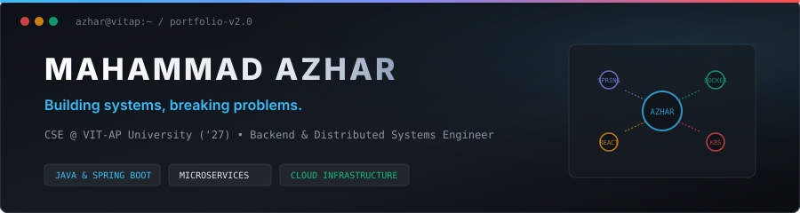
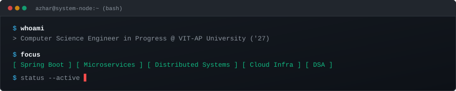
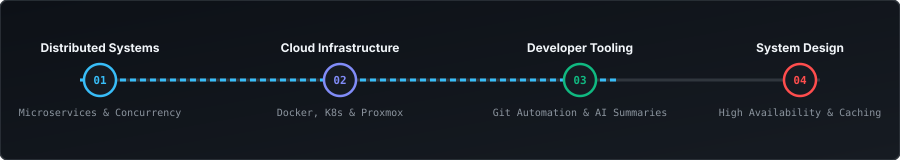
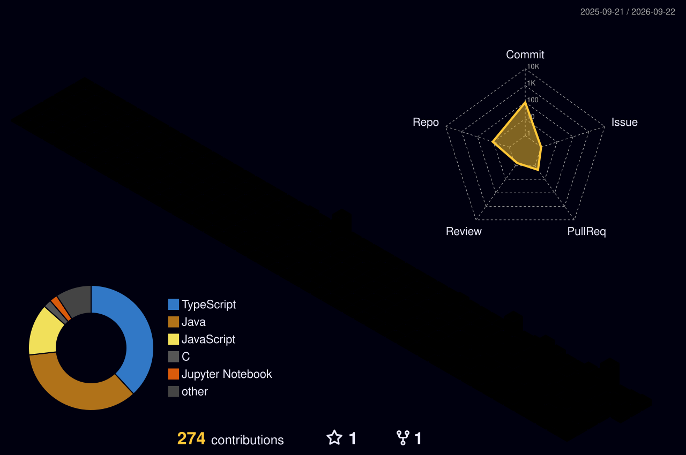
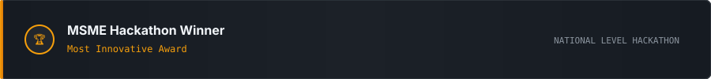

  
  
   

  

     &nbsp;
     &nbsp;
     &nbsp;
    
  

 

<!-- CURRENT FOCUS -->

  

 

---

## Technical Stack

<table width="100%" border="0" fill="#0D1117">
  <tr>
    <td width="50%" valign="top">
      <h4>LANGUAGES</h4>
      
<code>Java</code> &nbsp; <code>C</code> &nbsp; <code>R</code> &nbsp; <code>TypeScript</code> &nbsp; <code>SQL</code>

      <h4>BACKEND ENGINEERING</h4>
      
<code>Spring</code> &nbsp; <code>Spring Boot</code> &nbsp; <code>Microservices</code> &nbsp; <code>REST APIs</code> &nbsp; <code>FastAPI</code>

      <h4>FRONTEND DEVELOPMENT</h4>
      
<code>React.js</code> &nbsp; <code>Vite</code> &nbsp; <code>Tailwind CSS</code> &nbsp; <code>HTML5/CSS3</code>

    </td>
    <td width="50%" valign="top">
      <h4>DATABASE &amp; STORAGE</h4>
      
<code>PostgreSQL</code> &nbsp; <code>Redis</code> &nbsp; <code>MongoDB</code>

      <h4>DEVOPS &amp; CLOUD INFRASTRUCTURE</h4>
      
<code>Docker</code> &nbsp; <code>Kubernetes</code> &nbsp; <code>CI/CD Pipelines</code> &nbsp; <code>Proxmox VE</code>

      <h4>DEVELOPER TOOLS</h4>
      
<code>Git</code> &nbsp; <code>GitHub</code> &nbsp; <code>Linux</code> &nbsp; <code>Postman</code>

    </td>
  </tr>
</table>

 

  

 

---

## Featured Projects

<table width="100%">
  <tr>
    <td width="50%" valign="top">
      <h3>01. GradIntern</h3>
      
<b>Job &amp; Internship Platform</b>

      
Comprehensive recruitment platform tailored for students and enterprise recruiters. Features dual-role authentication portals, real-time job posting, advanced applicant filtering, and automated CSV export pipelines.

      
<b>Technologies:</b> React • Vite • Tailwind CSS • REST APIs

      
<a href="https://github.com/codebug53"><b>View Repository &rarr;</b></a>

    </td>
    <td width="50%" valign="top">
      <h3>02. CommitIQ / Git Divergence</h3>
      
<b>Developer Productivity &amp; Git Automation</b>

      
AI-assisted developer tooling that converts raw Git commits into semantic, contextual summaries and attaches structured documentation directly into native Git notes metadata.

      
<b>Technologies:</b> Git CLI • AI Processing • Python • Shell

      
<a href="https://github.com/codebug53"><b>View Repository &rarr;</b></a>

    </td>
  </tr>
  <tr>
    <td width="50%" valign="top">
      <h3>03. RenKairo</h3>
      
<b>Private Cloud &amp; Infrastructure Orchestration</b>

      
Private cloud management concept integrating containerized environment provisioning, Proxmox hypervisor orchestration, real-time telemetry monitoring, and reactive web control interface.

      
<b>Technologies:</b> React • Spring Boot • Docker • Proxmox • Monitoring

      
<a href="https://github.com/codebug53"><b>View Repository &rarr;</b></a>

    </td>
    <td width="50%" valign="top">
      <h3>04. Smart Expiry Detection</h3>
      
<b>AI-Assisted Food Management System</b>

      
IoT and computer vision system using ESP32-CAM hardware capture and OCR models to detect item expiration dates, synchronized with a FastAPI backend and MongoDB storage.

      
<b>Technologies:</b> ESP32-CAM • Computer Vision • FastAPI • MongoDB • JWT

      
<a href="https://github.com/codebug53"><b>View Repository &rarr;</b></a>

    </td>
  </tr>
</table>

 

---

## Engineering Focus & Roadmap

  

 

---

## Open Source & Developer Tooling

### CommitIQ / Git Divergence
* **Objective**: Streamline commit history analysis and automate release note documentation for engineering teams.
* **Mechanism**: Intercepts Git commit pipelines, generates semantic structured summaries using localized models, and persists context using `git-notes` without altering git tree hashes.
* **Impact**: Eliminates manual changelog creation and enhances code auditability across team repositories.

 

---

## GitHub Dashboard & Analytics

  

 

<table width="100%" border="0">
  <tr>
    <td width="50%" align="center" valign="top">
      
    </td>
    <td width="50%" align="center" valign="top">
      
    </td>
  </tr>
</table>

 

  

 

---

## Achievements

  

 

---

## Engineering Philosophy

1. **Build systems, not just features.** Focus on architectural integrity, isolation, and end-to-end reliability.
2. **Understand the abstraction before using it.** Dive beneath framework magic to master memory, I/O, and runtime behavior.
3. **Prefer simple architectures that scale when necessary.** Avoid premature complexity; design clean interfaces first.
4. **Learn by shipping.** True technical depth comes from deploying real code to production runtimes.

 

---

## Contact & Connect

  
<b>Let's build something useful.</b>

  

    <a href="https://github.com/codebug53">GitHub</a> &nbsp;&bull;&nbsp;
    <a href="YOUR_LINKEDIN_URL">LinkedIn</a> &nbsp;&bull;&nbsp;
    <a href="mailto:azhar@renkairo.dev">Email</a> &nbsp;&bull;&nbsp;
    <a href="YOUR_PORTFOLIO_URL">Portfolio</a>
  

   

  <pre><code>$ exit
Thanks for visiting.</code></pre>

