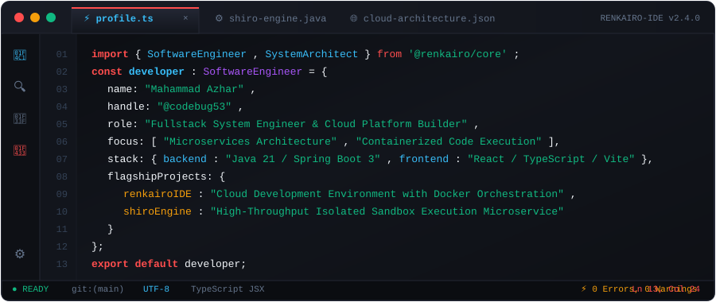
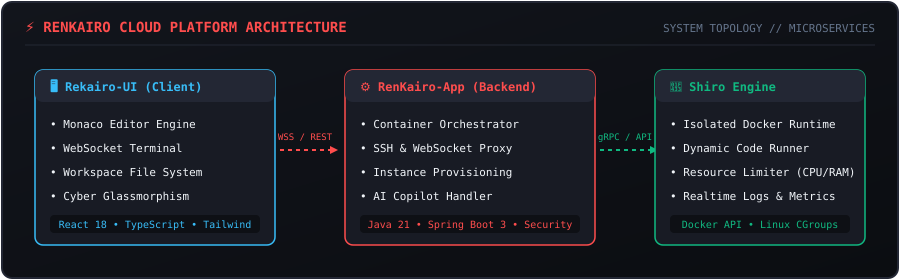
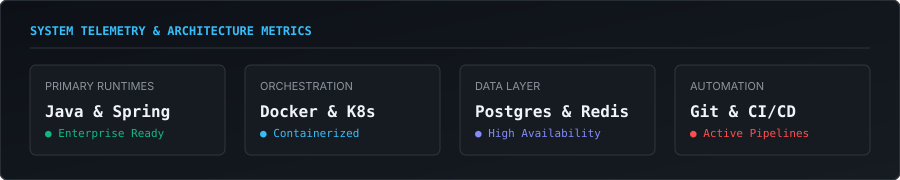

<div align="center">

  <!-- Interactive Custom RenKairo IDE Window Header SVG -->
  

  <br /><br />

  <!-- Status Pill Badges -->
  <p align="center">
    <a href="https://github.com/codebug53"></a>
    <a href="https://github.com/codebug53"></a>
    <a href="https://github.com/codebug53"></a>
  </p>

</div>

<br />

### ⚡ System Architecture Topology

<p align="center">
  
</p>

<br />

---

### 🚀 Flagship Systems & Projects

<table width="100%" border="0">
  <tr>
    <td width="50%" valign="top">
      <h3 align="left">⚡ RenKairo Cloud IDE</h3>
      <p>A fullstack browser-based cloud development environment designed for high efficiency, complete with dynamic container provisioning, live Monaco Editor integration, WebSocket SSH terminal, and an AI copilot assistant.</p>
      <p>
        
        
        
        
      </p>
    </td>
    <td width="50%" valign="top">
      <h3 align="left">🐳 Shiro Execution Sandbox</h3>
      <p>Distributed microservice dedicated to secure, high-throughput code execution inside isolated Docker containers with memory/CPU CGroups enforcement and real-time logs streaming.</p>
      <p>
        
        
        
        
      </p>
    </td>
  </tr>
  <tr>
    <td width="50%" valign="top">
      <h3 align="left">🛠️ Blog Installer Platform</h3>
      <p>Modern modular content deployment tool built with React, Vite, and Node.js for zero-config fullstack deployment and automated installation management.</p>
      <p>
        
        
        
      </p>
    </td>
    <td width="50%" valign="top">
      <h3 align="left">🌐 Microservices Ecosystem</h3>
      <p>Production-ready backend microservices leveraging PostgreSQL multi-tenancy, JWT auth stateless token management, and SSH web tunnels.</p>
      <p>
        
        
        
      </p>
    </td>
  </tr>
</table>

<br />

---

### 📊 System Capability Telemetry

<p align="center">
  
</p>

<br />

---

### 🛠️ Technology Stack & Matrix

<div align="center">

| Domain | Technologies |
| :--- | :--- |
| **Languages & Runtimes** | `Java 21` • `TypeScript` • `JavaScript (ES6+)` • `SQL` • `HTML5 / CSS3` |
| **Backend & Microservices** | `Spring Boot 3` • `Spring Security` • `Node.js` • `RESTful APIs` • `WebSockets` • `gRPC` |
| **Frontend & UI Systems** | `React.js` • `Vite` • `Tailwind CSS` • `Monaco Editor` • `Glassmorphism Design Systems` |
| **Databases & Storage** | `PostgreSQL` • `Redis` • `Hibernate / JPA` |
| **DevOps & Containers** | `Docker` • `Git / GitHub` • `Maven` • `PowerShell` • `Linux (Ubuntu/Debian)` |

<br />

<p align="center">
  
  
  
  
  
  
  
  
</p>

</div>

<br />

---

### 📈 GitHub Analytics & Activity Stream

<div align="center">

  <table border="0" width="100%">
    <tr>
      <td width="50%" align="center">
        
      </td>
      <td width="50%" align="center">
        
      </td>
    </tr>
  </table>

  <br />

  

</div>

<br />

---

### 💻 RenKairo Terminal CLI

```bash
azhar@renkairo-os:~$ info --user codebug53
[INFO] User: Mahammad Azhar
[INFO] Core Expertise: Java Backend Engineering, High-Performance Microservices, Modern Web IDE UI
[INFO] Currently Building: RenKairo IDE & Shiro Execution Sandbox
[INFO] Open for: High-impact software engineering roles & backend system projects

azhar@renkairo-os:~$ ping -c 3 azhar@renkairo.dev
64 bytes from azhar@renkairo.dev: icmp_seq=1 ttl=64 time=0.042 ms
64 bytes from azhar@renkairo.dev: icmp_seq=2 ttl=64 time=0.038 ms
64 bytes from azhar@renkairo.dev: icmp_seq=3 ttl=64 time=0.035 ms
--- azhar@renkairo.dev ping statistics ---
3 packets transmitted, 3 received, 0% packet loss, time 0ms
```

<br />

---

### 📬 Connect & Command Palette

<div align="center">

  <p align="center">
    Want to discuss distributed systems, cloud IDE development, or software engineering opportunities?
  </p>

  <a href="https://github.com/codebug53">
    
  </a>
  <a href="mailto:azhar@renkairo.dev">
    
  </a>
  <a href="https://linkedin.com">
    
  </a>

  <br /><br />
  
  <sub><code>RENKAIRO-IDE // SESSION: STABLE // SYSTEM_HEALTH: 100%</code></sub>

</div>
