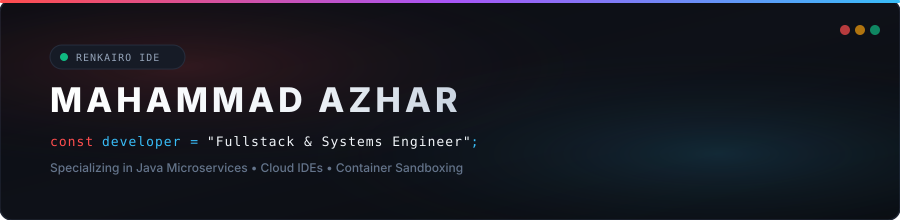

<div align="center">
  
</div>

<br />

### 👋 About Me

I am a **Software Engineer** passionate about building high-performance backend systems, distributed microservices, and next-generation cloud developer tools.

- ⚙️ **Core Focus**: High-concurrency backend services, containerized execution engines, and cloud IDE platforms.
- 🚀 **Currently Building**: [RenKairo IDE](https://github.com/codebug53) — A cloud development environment with live container provisioning and Monaco editor integration.
- 🐳 **System Infrastructure**: Architecting [Shiro](https://github.com/codebug53) — A high-throughput isolated code execution engine using Docker sandboxes.
- 🛠️ **Tech Stack**: Java (Spring Boot), TypeScript, React, Docker, PostgreSQL, WebSockets.

<br />

---

### ⚡ Selected Work

```
┌── [01] RENKAIRO CLOUD IDE ─────────────────────────────────────────────────────────────┐
│    Fullstack cloud development platform featuring dynamic container provisioning,      │
│    live Monaco Editor integration, WebSocket SSH terminal, and AI assistance.           │
│    Tech: React • TypeScript • Spring Boot 3 • WebSockets • Docker                     │
└────────────────────────────────────────────────────────────────────────────────────────┘

┌── [02] SHIRO EXECUTION ENGINE ─────────────────────────────────────────────────────────┐
│    Distributed microservice for executing code securely inside isolated Docker        │
│    containers with strict CPU & memory resource limits.                                │
│    Tech: Java 21 • Spring Boot • Docker API • Linux CGroups                            │
└────────────────────────────────────────────────────────────────────────────────────────┘

┌── [03] BLOG INSTALLER PLATFORM ────────────────────────────────────────────────────────┐
│    Modular web application installer enabling rapid fullstack blogging platform        │
│    deployment and automated configuration management.                                  │
│    Tech: React • Vite • Node.js • Tailwind CSS                                         │
└────────────────────────────────────────────────────────────────────────────────────────┘
```

<br />

---

### 🛠️ Tech Stack

<div align="center">

```
   [ Backend ]     Java 21  │  Spring Boot 3  │  Node.js  │  REST APIs  │  WebSockets
   [ Frontend ]    TypeScript  │  React  │  Vite  │  Tailwind CSS  │  Monaco Editor
   [ Infra & DB ]  Docker  │  PostgreSQL  │  Linux  │  Git  │  Maven  │  PowerShell
```

<p align="center">
  
</p>

</div>

<br />

---

### 📈 Activity & Telemetry

<div align="center">

  <table border="0" width="100%">
    <tr>
      <td width="50%" align="center">
        
      </td>
      <td width="50%" align="center">
        
      </td>
    </tr>
  </table>

</div>

<br />

---

### 📬 Connect

<div align="center">

  <p>
    <a href="https://github.com/codebug53"><b>GitHub</b></a> &nbsp;•&nbsp;
    <a href="mailto:azhar@renkairo.dev"><b>Email</b></a> &nbsp;•&nbsp;
    <a href="https://linkedin.com"><b>LinkedIn</b></a>
  </p>

  <sub><code>RENKAIRO SYSTEM // MINIMALIST DESIGN SYSTEM</code></sub>

</div>
